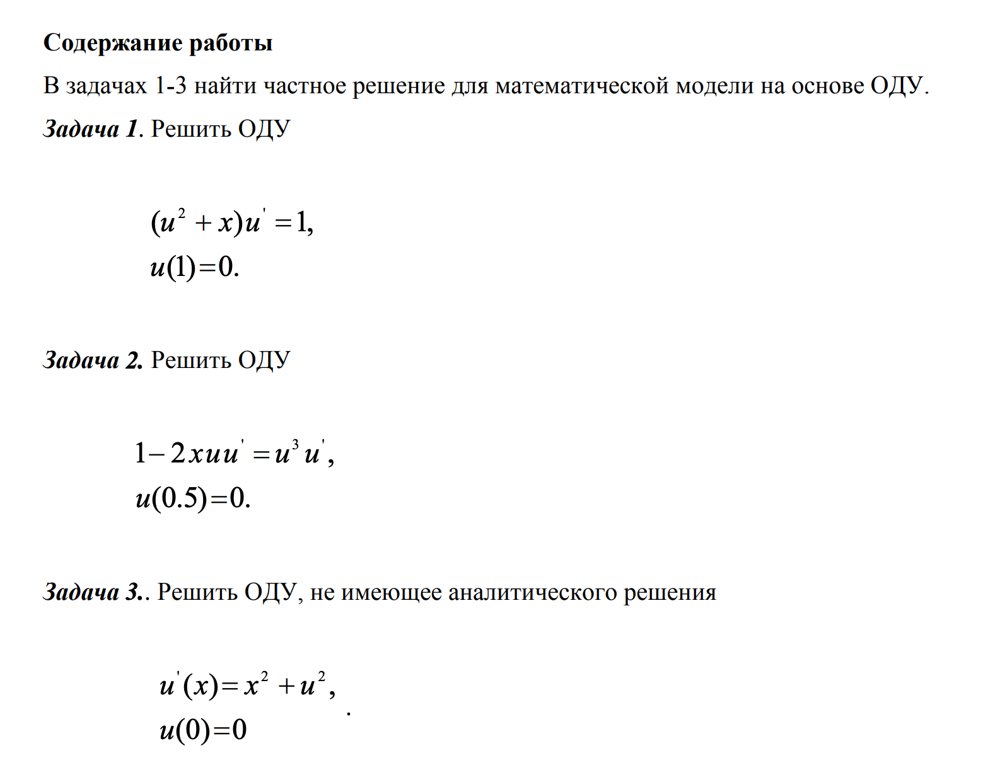
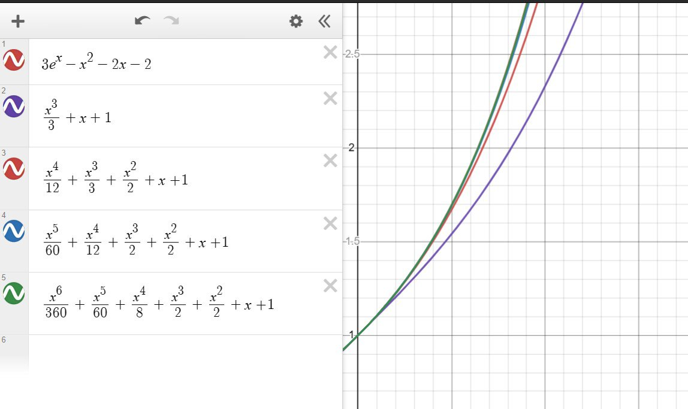
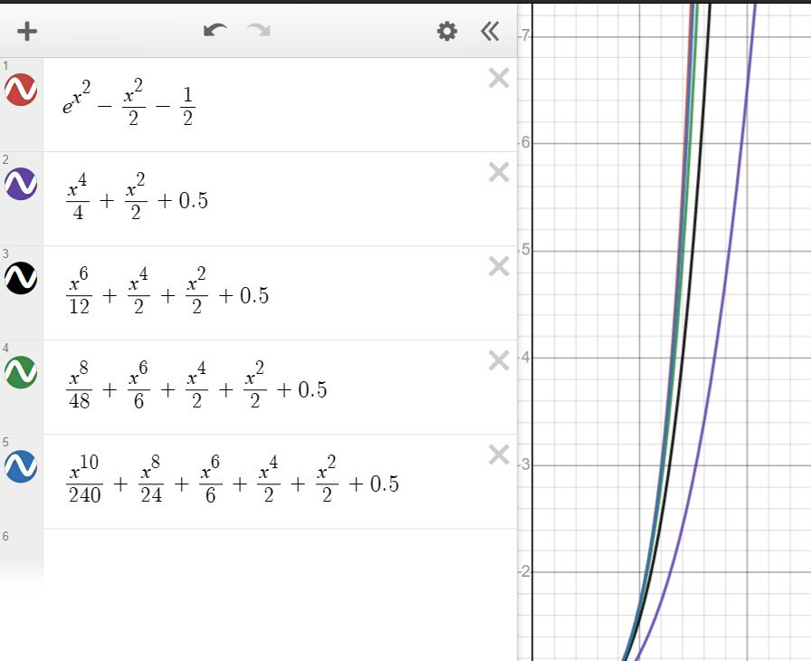
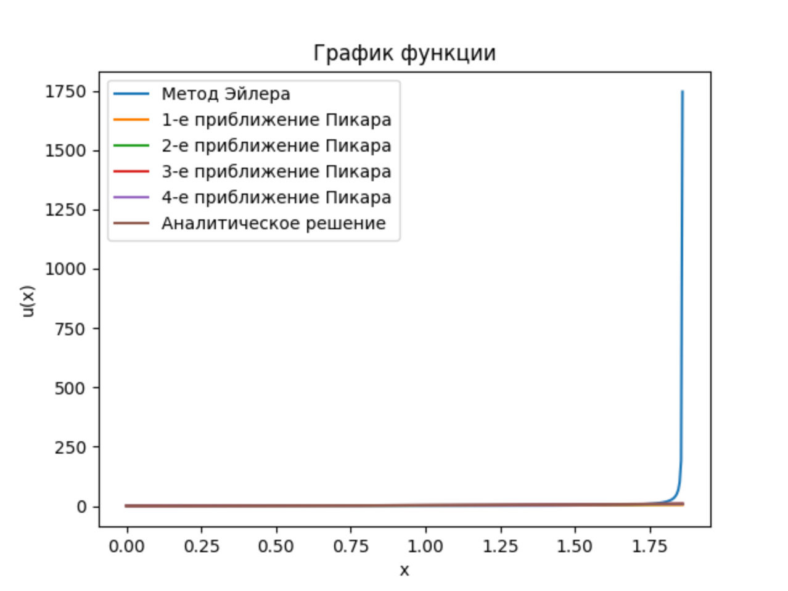
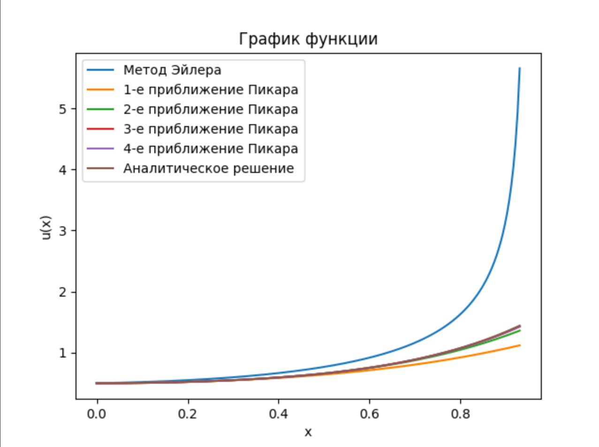
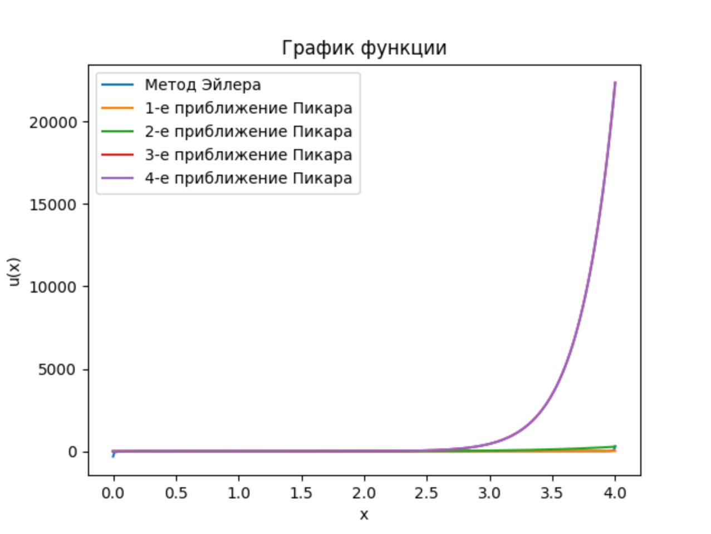
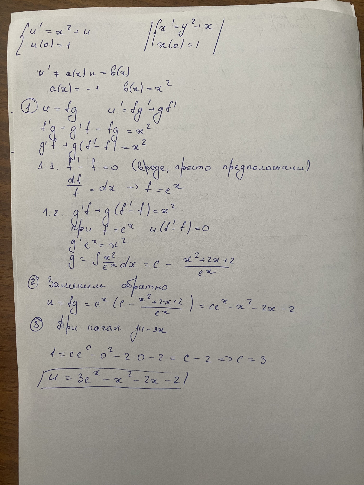

# Лабораторная 1
 
### Тема   
Программная реализация приближенного аналитического метода и численного алгоритма первого порядка точности при решении задачи Коши для ОДУ.  

### Цель работы  
Получение навыков решения задачи Коши для ОДУ методами Пикара и явным методом первого порядка точности (Эйлера).  

### Задание  

В задачах 1, 2 построить таблицу, содержащую в первом столбце значения аргумента, во втором - аналитическое решение, в третьем - численное решение методом Эйлера, в остальных - 1-4-е приближения метода Пикара. Показать, что метод Пикара сходится к точному аналитическому решению. В задаче 3 построить таблицу, содержащую значения аргумента с заданным шагом в интервале [0, xmax] и результаты расчета функции u(x) в приближениях Пикара (от 1-го до 4-го), а также численным методом. Границу интервала xmax выбирать максимально возможной из условия, чтобы численный метод обеспечивал точность вычисления решения уравнения u(x) до второго знака после запятой. 

### Решение

#### Сначала нарисовали в десмосе
По порядку:
- аналит решение  
- 1 приближение Пикара
- 2 приближение Пикара  
- 3 приближение Пикара  
- 4 приближение Пикара  

1 уравнение  

2 уравнение  

#### Из проги

График к 1 решению

График ко 2 решению

График к 3 решению

## Загадки с защиты

- _Почему приближение 1e-6?_  

Доказать правильность полученного результата при фиксированном значении аргумента в численных методах можно посредством постепенного уменьшения шага. Когда программировала, сначала взяла шаг 1e-1 и посмотрела значение функции при фиксированном значении аргумента. Потом взяла 1e-2 и посмотрела разницу со значением функции при 1e-1, далее смотрела разницу 1e-3 и 1e-2 и тд. Потом дошла до минимальной разницы значений функции при 1e-5 и 1e-6.

- _Вывести аналит решение (руками вывели для 1го только, для лабы просто вбивали в онлайн калькулятор ОДУ)_  

- _В 3 уравнении после 2 для Эйлера нельяза высчитать решения (на компьютере, там очень большие числа). 
Как аналитически найти точку разрыва? И двойка ли это, могу я найти в 2.01 например значение функции?_

Удачи, ребят. Мы сдавали первые ("Вы первопроходцы!"), не ответили, этот вопрос оставили вам :)
